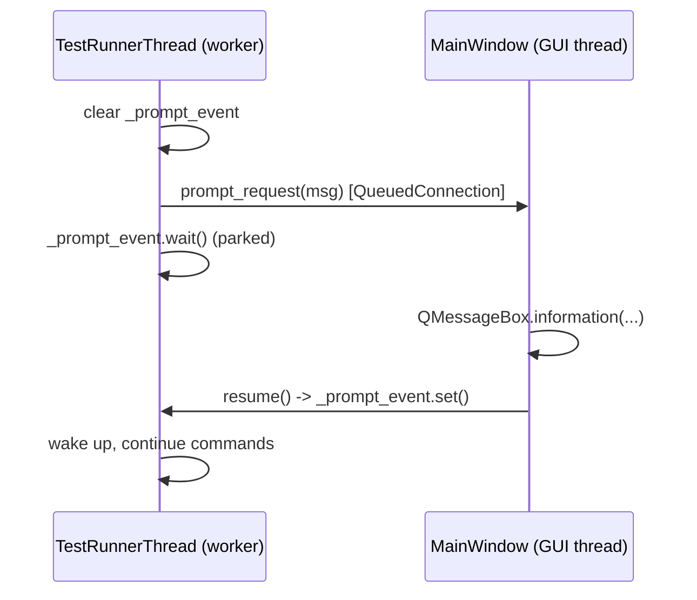
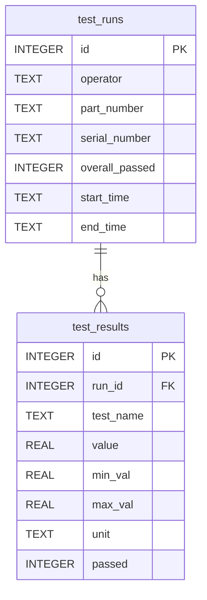
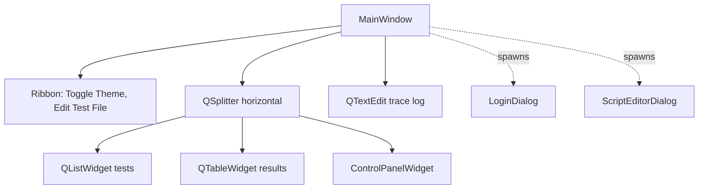
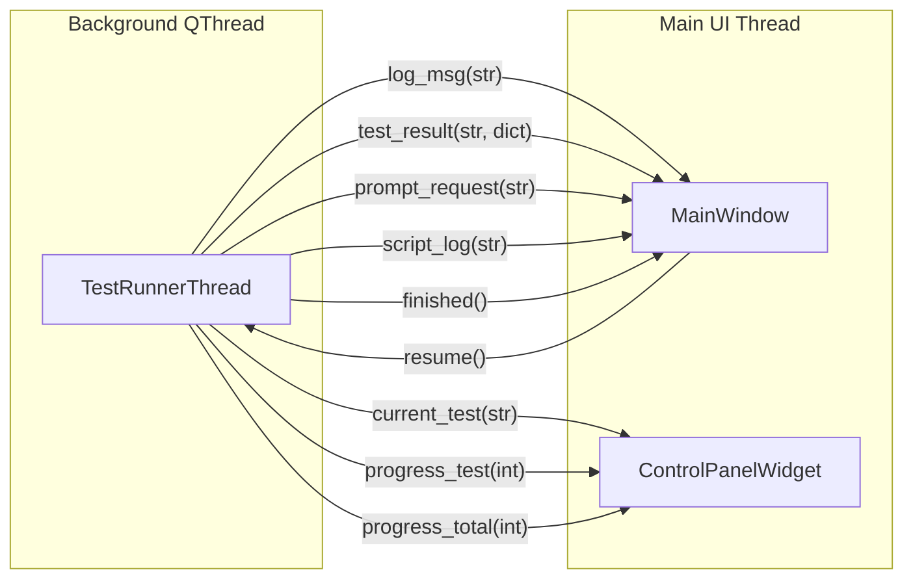
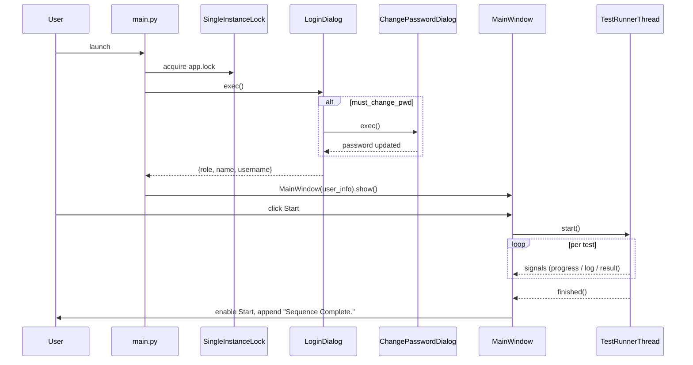

# ARCHITECTURE DEEP DIVE - The Technical Bible

This document is the canonical reference for *how* DFX_ate is built. Every
non-trivial code change must be reflected here in the same commit. If a section
contradicts the source, the source is wrong - fix the source, not the doc.

---

## 1. Threading model

The single most important design choice in DFX_ate is that **the GUI thread
never blocks**. Test execution is bounded by real-world hardware timing
(measurements, settling, sleeps), so it lives entirely inside a
`QThread` subclass.

### 1.1 The runner

`TestRunnerThread` (`src/logic/test_engine.py`) extends `QThread`. It owns:

- the list of test names to execute,
- a `LimitManager` for spec lookups,
- a `MockHardware` instance (the only point of "I/O"),
- a `DatabaseManager` for persistence,
- a single boolean `_stop_requested` used as a cooperative cancel flag.

`run()` iterates `loop_count x test_names`, and at each iteration:

1. Emits `current_test`, then `progress_test(0)`, then a `log_msg`.
2. Looks up the spec via `LimitManager.get_limit(test_name)`.
3. Calls `_simulate_test_progress()` (intermediate `progress_test` ticks).
4. Calls `MockHardware.run_test(test_name)` - **the blocking call**.
5. Compares to limits, builds a `TestResultPayload`, emits `test_result`,
   appends to the in-memory `TestRunRecord.results`.
6. Honors `stop_on_fail` and the cooperative `_stop_requested` flag.
7. In the `finally:` block, stamps `end_time`, persists the run via
   `DatabaseManager.save_run`, and lets QThread emit its built-in `finished`
   signal.

### 1.2 Cancellation

Cancellation is cooperative, not pre-emptive. `MainWindow.stop_tests` calls
`TestRunnerThread.stop()`, which sets `_stop_requested = True`. The runner
checks the flag at every loop boundary, between each test, and between each
command inside a step. This avoids forcibly terminating a thread
mid-measurement, which would leak hardware state.

### 1.3 In-script delays

The `Delay <ms>` command in a `.tst` file is **runner-side**: it is
intercepted by `TestRunnerThread._execute_command` and serviced via
`self.msleep()`. It never reaches `MockHardware`, and no logic helper ever
calls `time.sleep` to implement it - that would violate Rule 2.

### 1.4 Prompt synchronization

The `Prompt <msg>` command parks the runner thread mid-step until the
operator acknowledges a `QMessageBox`. The synchronization uses a
standard-library `threading.Event` (`self._prompt_event`):

`stop()` also sets `_prompt_event`, so a parked thread can be cancelled:
the wait returns, the runner notices `_stop_requested`, and exits cleanly
through the existing `finally:` block (which still saves whatever has been
recorded so far).

This is the only place outside `QtCore` where the logic layer touches a
threading primitive - it is exempt from Rule 1 by the same justification
that allows `QThread` / `Signal` in `test_engine.py`.

### 1.5 Why off the GUI thread

Anything that calls `time.sleep`, talks to instruments, or runs a long
computation on the main thread freezes the entire window (no repaints, no
input). The QThread separation guarantees:

- progress bars actually animate during tests,
- `Stop` is always responsive,
- the user can resize/minimize the window mid-run.

This is also why `DEVELOPMENT_RULES.md` forbids `time.sleep` and hardware
calls outside a `QThread`.

---

## 2. Hybrid data strategy

DFX_ate splits persistence by **mutability** and **purpose**:

| Concern                  | Backend     | File                       | Why                                                                 |
| ------------------------ | ----------- | -------------------------- | ------------------------------------------------------------------- |
| Test sequence (config)   | Plain text  | `src/data/*.tst`           | Edited in-app via `ScriptEditorDialog`; parsed by `ScriptManager` into `TestStep` objects with inline limits, units, and `Critical` flags. |
| Spec limits (legacy)     | JSON        | `src/data/limits.json`     | Superseded by inline `Limits` keyword in `.tst` files. `LimitManager` is no longer wired into the runtime; retained for reference. |
| Historical run results   | SQLite      | `src/data/database.db`     | Append-only, queryable, supports relational integrity.              |

### 2.1 Script engine

`ScriptManager` (`src/logic/script_manager.py`) is the single seam for `.tst`
files - it owns raw `read_script` / `write_script` (used by the editor) and
the `load_script` parser (used by the runner). The grammar is documented in
[KEYWORDS_DICTIONARY.md](KEYWORDS_DICTIONARY.md); summary:

- Lines starting with `:` open a new `TestStep`.
- Inside a step, the case-insensitive keywords `Critical`, `Limits <min> <max>`,
  `Target <val> Tol <pct>`, `Unit <str>`, and `Retry <n>` configure that step.
- `Limits` and `Target/Tol` are mutually exclusive; specifying both is a parse
  error. `Target/Tol` resolves to `min = val * (1 - pct/100)`,
  `max = val * (1 + pct/100)` at parse time, so the runner never has to know
  which form was used.
- Every other non-comment line is a `{"cmd": str, "args": list[str]}` entry
  appended to the step's command list. The runner-side commands `Delay`,
  `Log`, and `Prompt` are recognized at execution time and never reach the
  hardware driver.
- Bad input raises `ScriptParseError(line_no, line, msg)` so the trace log
  shows precisely which line is wrong.

The runner walks each step in order, dispatching commands through
`MockHardware.execute_command` (with the runner-side overrides above). The
**last** measurement value returned in a step is compared against the step's
limits to decide pass/fail. A step **with** limits but no executed
measurement command is logged and marked FAIL. A step **without** limits
passes as long as none of its commands raise; it appears in the results
table with `-` for value/min/max.

`Critical` is enforced at the step boundary: when a step is critical and
fails (after exhausting any retries), the runner emits
`CRITICAL ABORT: <name> failed; halting sequence.`, breaks both loops, and
falls through to the existing `finally:` block which persists the partial
run via `DatabaseManager.save_run`.

#### Retry semantics

A step with `Retry N` runs **at most `N + 1` times**. Behavior:

- Intermediate failures emit `<step>: attempt k/N+1 failed, retrying...` to
  the trace log but do **not** produce a results-table row or a DB entry.
- Exactly one `test_result` is emitted per step, reflecting the final
  attempt only. The same is true for the `TestRunRecord.results` list that
  is persisted to SQLite - history stays clean.
- `Critical` evaluation runs against the final attempt: a critical step
  that ultimately passes after retrying does **not** abort the run.
- A pending stop request short-circuits the retry loop at the next attempt
  boundary.

### 2.2 Test scripts: `.tst`

The editor never writes via direct `Path.write_text` - it always goes through
`ScriptManager.write_script`, which validates the `.tst` suffix.

### 2.3 History: SQLite

`DatabaseManager` (`src/logic/database_manager.py`) uses stdlib `sqlite3`
with `PRAGMA foreign_keys = ON;` and parameterized queries. The schema:

Booleans are stored as `INTEGER` (0/1) per SQLite convention; timestamps as
ISO-8601 strings. `save_run` performs the parent insert, captures
`lastrowid`, and bulk-inserts children with `executemany` inside a single
transaction (the `with conn:` block commits atomically).

### 2.4 Why the split

Configuration changes hands between humans (engineers reviewing limits) and
should live in version control. Run history is machine-generated, append-only,
and benefits from indexed relational queries. Mixing them - for example,
storing limits as DB rows - would couple every limit edit to a schema
migration and break the diff workflow.

---

## 3. UI composition

`MainWindow` (`src/ui/views/main_window.py`) is the composition root. It owns
the layout but **delegates input concerns** to dedicated widgets and dialogs:

Key contract: dialogs are constructed with `parent=self` (the main window)
so the active QSS stylesheet propagates down the widget tree. This is why
the script editor and login dialog automatically follow the current theme
without separately loading a `.qss` file.

`ControlPanelWidget` (`src/ui/widgets/control_panel.py`) owns its own
sub-layout (Start/Stop buttons, User group box, Unit group box, Status
group box with progress + counters + loop options). `MainWindow` only
references its public attributes (`btn_start`, `progress_total`, etc.) to
wire signals; it does not reach into private layout.

---

## 4. Signal/slot map

All cross-thread communication happens through Qt's signal/slot mechanism,
which delivers across a `QueuedConnection` automatically when source and
destination live on different threads. This is the *only* sanctioned way to
push data from the runner to the UI.

Concrete connections established in `MainWindow.start_tests`:

| Signal (source)                              | Slot (destination)                                  |
| -------------------------------------------- | --------------------------------------------------- |
| `TestRunnerThread.log_msg(str)`              | `MainWindow.append_trace`                           |
| `TestRunnerThread.test_result(str, dict)`    | `MainWindow.update_results_table`                   |
| `TestRunnerThread.progress_total(int)`       | `ControlPanelWidget.progress_total.setValue`        |
| `TestRunnerThread.progress_test(int)`        | `ControlPanelWidget.progress_test.setValue`         |
| `TestRunnerThread.current_test(str)`         | `ControlPanelWidget.edit_current_test.setText`     |
| `TestRunnerThread.prompt_request(str)`       | `MainWindow._on_prompt_request`                     |
| `TestRunnerThread.script_log(str)`           | `MainWindow._on_script_log`                         |
| `TestRunnerThread.finished` (built-in)       | `MainWindow.on_tests_finished`                      |

The reverse direction is not a Qt signal but a plain method call: once the
operator dismisses the message box, the slot calls `runner.resume()` from
the GUI thread, which sets the runner's `threading.Event` and lets the
parked worker continue (see Section 1.4).

The runner emits a `dict` payload (not a `TestResultPayload` instance) so
the receiving slot does not need to import the typed-dict definition; the
shape is documented in `logic/models.py` as `TestResultPayload`. The payload
includes an `is_measurement: bool` field - when `False`, `MainWindow.update_results_table`
renders `-` in the value/min/max columns (used for setup/teardown steps that
have no `Limits`).

---

## 5. Application boot flow

---

## 6. Authentication and RBAC

### 6.1 Users table

`DatabaseManager` owns a `users` table with these fields:

- `username` (unique, case-insensitive)
- `password_hash` + `salt` (PBKDF2-HMAC-SHA256, 200,000 iterations)
- `role` (`Operator`, `Engineer`, `Admin`)
- `must_change_pwd` (boolean flag)

On startup/schema bootstrap, an idempotent seed ensures admin user `lior`
exists with `must_change_pwd = 0`.

### 6.2 Role gates in the UI

- **Operator**: can run tests, cannot edit scripts, Min/Max columns are hidden, and CSV/JSON exports omit Min/Max.
- **Engineer**: full execution + script editor access.
- **Admin**: Engineer permissions + Help -> User Management dialog.

Important: role gating is presentation-layer only; database persistence of
measurements remains complete (`min_val`/`max_val` are always stored in
`test_results`).

### 6.3 Password lifecycle

- Login verification is handled through `AuthManager -> DatabaseManager.verify_login`.
- If `must_change_pwd = 1`, login is blocked behind `ChangePasswordDialog`.
- Admin password reset and new-user creation issue secure temporary passwords
  and set `must_change_pwd = 1`.

### 6.4 Local single-instance protection

`main.py` acquires `SingleInstanceLock` (`src/logic/file_lock.py`) on app start.
The lock is a PID file (`src/data/app.lock`) created with exclusive semantics.
If another live process owns the lock, startup stops with a modal error.

---

## 7. Maintenance protocol

These five files in `DOC/` are part of the build, not commentary on it.

- **Every code change must update the relevant `DOC/` file in the same commit.**
- New files: add a row to `FILE_MANIFEST.md`.
- New signals or threads: update Section 4 (signal map) and Section 1.
- New tables, columns, or pragmas: update Section 2.3 and the ER diagram.
- New rules or exceptions: update `DEVELOPMENT_RULES.md` and link them here.
- New runtime/OS/dependency requirements: update `SPECIFICATIONS.md`.

If a PR touches `src/` and not `DOC/`, the author must justify the omission
in the PR description. Drift is the failure mode this directory exists to
prevent.
